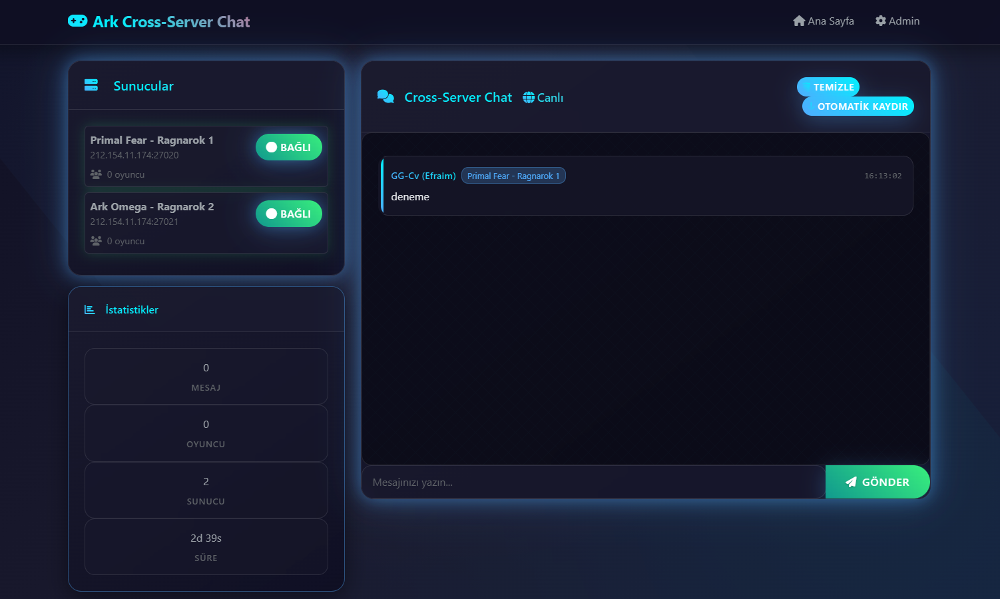
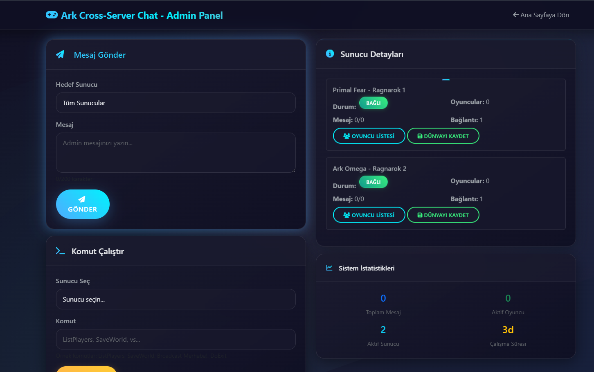

# 🎮 Ark Cross-Server Chat System

[
[](LICENSE)
[](https://docker.com/)
[](#-screenshots)

> **🌟 Modern, responsive ve kullanıcı dostu Ark Survival Evolved cross-server chat sistemi**

Modern ve mobil-uyumlu web arayüzü ile **Ark Survival Evolved** sunucularının chatlarını birleştiren profesyonel sistem.

## 📸 Screenshots

### 🖥️ **Ana Chat Arayüzü**

*Modern gradient tema ile responsive chat arayüzü - Gerçek zamanlı mesajlaşma, sunucu durumları ve istatistikler*

### 📱 **Mobil Görünüm**
  
*Touch-friendly mobil arayüz - Tüm özellikler mobil cihazlarda mükemmel çalışır*

### ⚙️ **Admin Panel**

*Güçlü admin paneli - Sistem yönetimi, broadcast mesajları ve detaylı istatistikler*

## ✨ Özellikler

### 🌐 **Cross-Server Chat**
- Birden fazla Ark sunucusu desteği
- Gerçek zamanlı mesaj senkronizasyonu
- Otomatik bağlantı yönetimi ve yeniden bağlanma

### 🎨 **Modern Web Arayüzü**
- Responsive tasarım (mobil, tablet, desktop)
- Real-time Socket.IO bağlantısı
- Modern gradient tema ve animasyonlar
- Touch-friendly butonlar

### 🛠️ **Gelişmiş Özellikler**
- RCON protokolü ile güvenli bağlantı
- Türkçe karakter desteği
- Spam ve döngü engelleme sistemi
- Chat geçmişi ve anlık istatistikler
- Admin paneli ile sistem yönetimi

### 🐳 **Deployment Seçenekleri**
- Docker desteği ile kolay kurulum
- Standalone kurulum
- Auto-installer scriptler (Windows/Linux)

## � Hızlı Başlangıç

### Otomatik Kurulum

**Windows:**
```powershell
./install.ps1
```

**Linux/macOS:**
```bash
chmod +x install.sh
./install.sh
```

### Manuel Kurulum

1. **Bağımlılıkları yükleyin:**
```bash
npm install
```

2. **Yapılandırma dosyasını oluşturun:**
```bash
cp config.example.json config.json
```

3. **Ark sunucularınızı yapılandırın:**
```json
{
  "servers": [
    {
      "id": "server1",
      "name": "Primal Fear - Ragnarok",
      "host": "192.168.1.100",
      "port": 27020,
      "password": "your_rcon_password"
    }
  ],
  "webPort": 3000,
  "chatPollingInterval": 5000
}
```

4. **Sistemi başlatın:**
```bash
npm start
```

## 📋 Gereksinimler

### 🖥️ **Sistem Gereksinimleri**
- Node.js 16+ 
- 512MB RAM
- 100MB disk alanı
- İnternet bağlantısı

### 🎮 **Ark Sunucu Ayarları**
GameUserSettings.ini dosyasına ekleyin:
```ini
[ServerSettings]
RCONEnabled=True
RCONPort=27020
ServerAdminPassword=your_rcon_password
```

## 🐳 Docker ile Kullanım

```bash
# Docker Compose ile
docker-compose up -d

# Manuel Docker
docker build -t ark-chat .
docker run -d -p 3000:3000 -v ./config.json:/app/config.json ark-chat
```

## 🎬 Live Demo & Features

### 🌟 **Ana Özellikler Gösterimi**

<table>
<tr>
<td width="50%">

**🖥️ Desktop Experience**
- Modern gradient arayüz
- Real-time chat synchronization  
- Server status monitoring
- Advanced statistics panel
- Admin management tools

</td>
<td width="50%">


</td>
</tr>
<tr>
<td width="50%">


</td>
<td width="50%">

**📱 Mobile Experience**
- Touch-optimized interface
- Responsive design adaptation
- One-handed operation
- Fast message sending
- Intuitive navigation

</td>
</tr>
<tr>
<td width="50%">

**⚙️ Admin Control Panel**
- System administration
- Broadcast messaging
- Chat history management
- Server health monitoring
- Real-time statistics

</td>
<td width="50%">


</td>
</tr>
</table>

### 🚀 **Key Features Demonstrated**

| Feature | Description | Screenshot |
|---------|-------------|------------|
| **Cross-Server Chat** | Messages sync instantly between all connected Ark servers | ✅ Screen 1 |
| **Mobile Responsive** | Perfect adaptation for phones and tablets | ✅ Screen 2 |
| **Admin Panel** | Complete system management and control | ✅ Screen 3 |
| **Turkish Support** | Full UTF-8 encoding with special characters (ğüşıöç) | ✅ All screens |
| **Real-time Updates** | Live server status and instant message delivery | ✅ All screens |

## 📱 Arayüz Kullanımı

### 🏠 **Ana Sayfa** (`http://localhost:3000`)
- Real-time chat görüntüleme
- Cross-server mesaj gönderme
- Sunucu durumları ve istatistikler
- Mobil-uyumlu responsive tasarım

### ⚙️ **Admin Panel** (`http://localhost:3000/admin`)  
- Admin mesajı gönderme
- Sistem istatistikleri
- Chat geçmişi yönetimi
- Sunucu kontrolü

## 📊 Özellik Detayları

### 🔒 **Güvenlik**
- RCON şifre koruması
- Input validation ve sanitization
- Rate limiting ve spam koruması
- XSS ve injection koruması

### 🌍 **Uluslararasılaştırma**
- Türkçe karakter desteği (ğ, ü, ş, ı, ö, ç)
- UTF-8 encoding
- Unicode mesaj desteği

### 📈 **Performans**
- Connection pooling
- Automatic reconnection
- Memory leak prevention
- Optimized polling system

## 🧪 Test Scriptleri

Test scriptleri `scripts/` klasöründe bulunmaktadır:

```bash
# RCON bağlantı testi
node scripts/test-rcon.js

# Chat sistemi testi  
node scripts/test-chat.js

# Türkçe karakter testi
node scripts/test-turkish-chars.js
```

Ark sunucularınızda aşağıdaki ayarları yapın:

1. `GameUserSettings.ini` dosyasında:
```ini
[ServerSettings]
RCONEnabled=True
RCONPort=27020
ServerAdminPassword=your_admin_password
```

2. Sunucuyu yeniden başlatın

## Web Arayüzü

Sistem başlatıldıktan sonra `http://localhost:3000` adresinden web arayüzüne erişebilirsiniz.

## 🤝 Katkıda Bulunma

1. Fork edin
2. Feature branch oluşturun (`git checkout -b feature/amazing-feature`)
3. Değişikliklerinizi commit edin (`git commit -m 'Add amazing feature'`)
4. Branch'inizi push edin (`git push origin feature/amazing-feature`)
5. Pull Request açın

## 📝 Değişiklik Geçmişi

- **v1.0.0** - İlk stabil sürüm
  - Cross-server chat sistemi
  - Modern web arayüzü
  - Docker entegrasyonu
  - Responsive mobil tasarım

## 📄 Lisans

Bu proje MIT lisansı altında lisanslanmıştır. Detaylar için [LICENSE](LICENSE) dosyasına bakın.

## 🆘 Destek

### 📞 **Sorun Bildirimi**
- GitHub Issues kullanın
- Detaylı bilgi ve log dosyaları ekleyin
- Sistem bilgilerinizi paylaşın

### 💡 **Özellik İstekleri**  
- GitHub Discussions kullanın
- Use case ve fayda belirtin
- Mockup veya örnek paylaşın

### 🛠️ **Teknik Destek**
- Wiki dokümanlarını kontrol edin
- FAQ bölümünü inceleyin  
- Community Discord'a katılın

## 🙏 Teşekkürler

- Node.js community
- Socket.IO developers
- Bootstrap framework
- Font Awesome icons
- Ark Survival Evolved modding community

## 🎨 Visual Showcase

<div align="center">

### 🌟 Complete Feature Overview

| Desktop | Mobile | Admin |
|---------|---------|--------|
|  |  |  |
| Modern chat interface with real-time sync | Touch-optimized responsive design | Complete administrative control |

### 🚀 **Ready to Transform Your Ark Community?**

> **Join thousands of Ark players enjoying seamless cross-server communication!**

[](https://github.com/USERNAME/ark-cross-server-chat/releases)
[](https://github.com/USERNAME/ark-cross-server-chat/wiki)
[](https://discord.gg/your-invite)

</div>

---

**Made with ❤️ for Ark Gaming Community**

*Bu sistem Ark Survival Evolved oyununu daha sosyal ve bağlantılı hale getirmek için geliştirilmiştir.*
